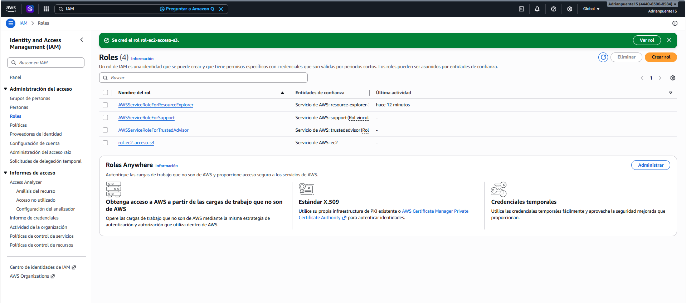
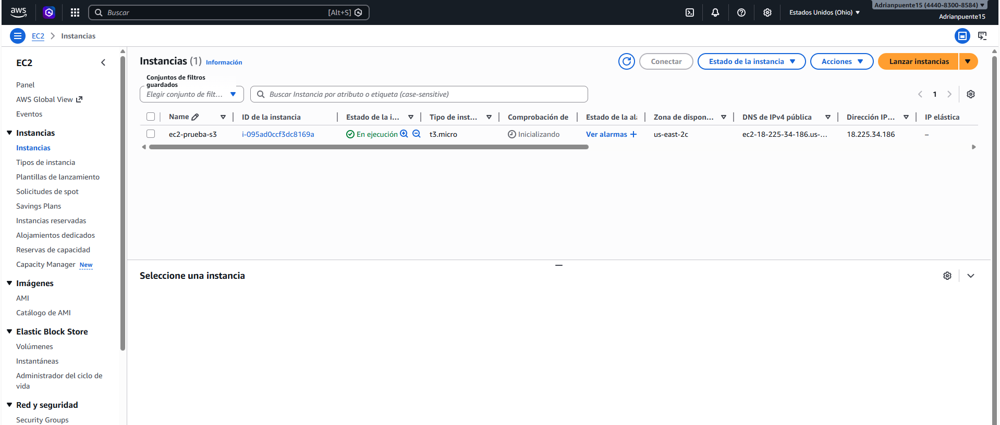
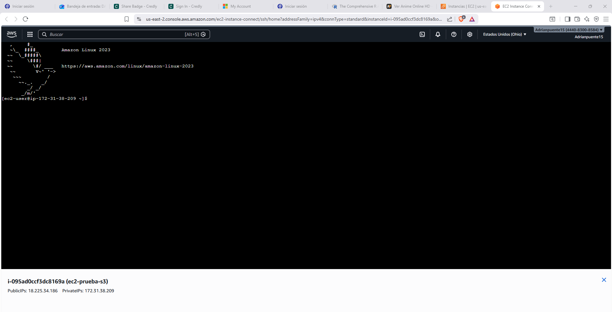
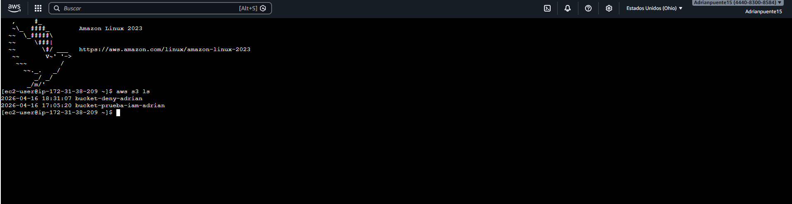
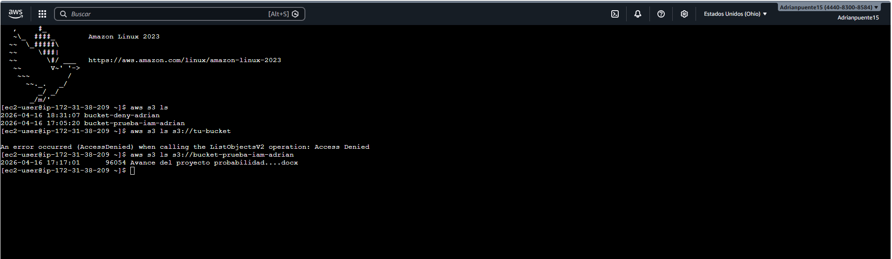

# AWS IAM - Acceso a S3 desde EC2 usando IAM Role

## Descripción

Implementación de acceso seguro a Amazon S3 desde una instancia EC2 utilizando IAM Roles, evitando el uso de credenciales manuales.

## Objetivo

Permitir que una instancia EC2 acceda a S3 sin necesidad de claves de acceso (Access Keys), utilizando roles de IAM.

## Arquitectura

* EC2 (Amazon Linux 2023)
* IAM Role con permisos a S3
* Bucket S3

## Pasos realizados

### 1. Creación de instancia EC2

Se lanzó una instancia tipo t3.micro utilizando Amazon Linux 2023.

---

### 2. Creación y asignación de IAM Role

Se creó un rol con permisos de acceso a S3 y se asignó a la instancia EC2.

---

### 3. Conexión a la instancia

Se accedió a la instancia mediante EC2 Instance Connect.

---

### 4. Verificación desde terminal

Se ejecutaron comandos AWS CLI desde la instancia.

---

### 5. Listado de buckets S3

Se verificó acceso a los buckets disponibles.

---

### 6. Acceso a archivos dentro del bucket

Se listaron objetos dentro de un bucket específico.

---

## Resultado

* Acceso exitoso a S3 desde EC2
* No se utilizaron credenciales manuales
* Autenticación realizada mediante IAM Role

---

## Aprendizajes

* Uso de IAM Roles en EC2
* Acceso seguro sin Access Keys
* Integración entre EC2 y S3
* Uso básico de AWS CLI

---

## Herramientas utilizadas

* AWS EC2
* AWS IAM
* AWS S3
* AWS CLI
* GitHub
